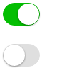

# ng2 switch
An switch component for Angular 2.


## Installation
```shell
$ npm install --save ng2-switch
```
## Usage
```js
import { NgSwitchModule } from '../src/ng2-switch';
@NgModule({
    imports: [NgSwitchModule]
})
```
```html
<ng-switch [(ngModel)]="value"></ng-switch>
```
## props
|     name    | description |     type    |   default   |
|-------------|-------------|-------------|-------------|
| disabled    | determine whether the Switch is disabled | Boolean     | false             |
| ngModel | two way bind | Boolean     | -             |

